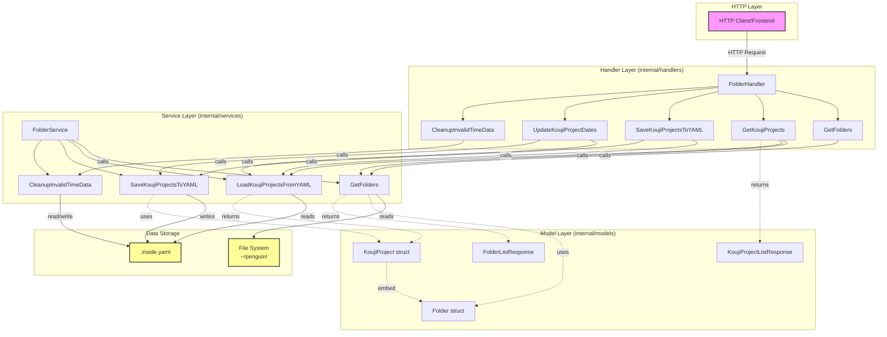

# Backend Architecture

このドキュメントは、Penguin Backend の internal パッケージ内の handlers、models、services の関係性を示しています。

## アーキテクチャ図

## レイヤーごとの責務

### Handler層 (internal/handlers/folder_handler.go)
- HTTPリクエスト/レスポンスの処理
- バリデーション
- Service層の呼び出し
- ビジネスロジック（プロジェクトのマージ、ステータス判定など）

### Service層 (internal/services/folder_service.go)
- ファイルシステムやYAMLファイルへのアクセス
- データの読み書き処理
- パスの展開（`~/`の処理）
- 時刻データの検証とフォーマット

### Model層 (internal/models/)
- データ構造の定義
- `Folder`: 基本的なファイル/フォルダ情報（CreatedDateを含む）
- `KoujiProject`: Folderを埋め込み、工事プロジェクト固有の情報を追加
- レスポンス用の構造体定義

## データフロー例

1. **フォルダ一覧取得**: 
   - Client → FolderHandler.GetFolders → FolderService.GetFolders → FileSystem

2. **工事プロジェクト取得**: 
   - Client → FolderHandler.GetKoujiProjects → FolderService.GetFolders + LoadKoujiProjectsFromYAML → FileSystem + YAMLFile

3. **工事プロジェクト保存**: 
   - Client → FolderHandler.SaveKoujiProjectsToYAML → FolderService.LoadKoujiProjectsFromYAML + SaveKoujiProjectsToYAML → YAMLFile

## 主要な処理の流れ

### GetKoujiProjects の処理
1. ファイルシステムから工事フォルダ一覧を取得
2. YAMLファイルから既存の工事プロジェクト情報を読み込み
3. project_id を基準に両者をマージ
4. 開始日の降順でソート
5. レスポンスとして返却

### SaveKoujiProjectsToYAML の処理
1. 既存のYAMLファイルを読み込み
2. ファイルシステムから最新の工事フォルダ情報を取得
3. project_id を基準にマージ（更新日時で新旧判定）
4. 異常な時刻データを持つプロジェクトを除外
5. YAMLファイルに保存